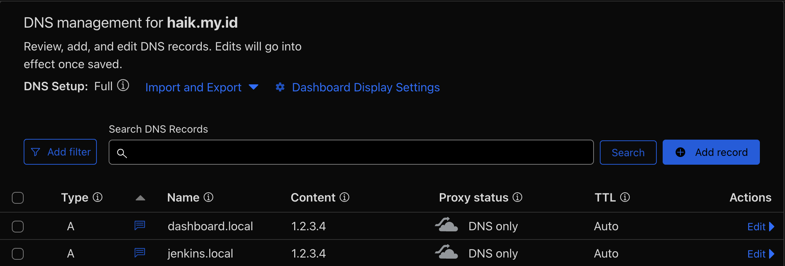
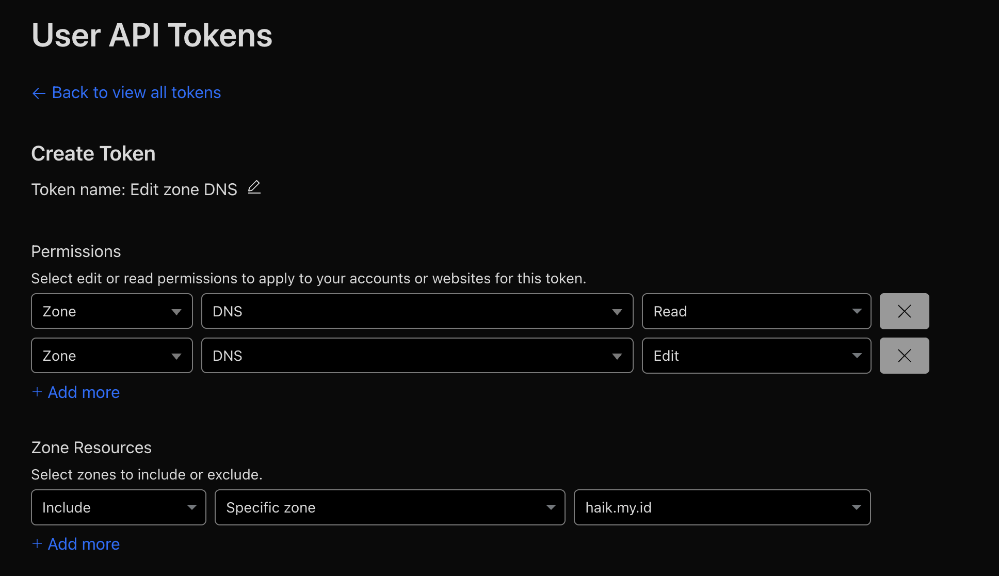

# Jenkins Installation with Docker and Reverse Proxy using Traefik

This project includes simple scripts and code how to install Continuous Integration / Continuous Deployment Tools, namely Jenkins using Docker Enginer and Docker Compose and then protect access with Transport Security Layers (TLS) with Traefik and Lets Encrypt.

## Requirements

This project requires some preparation on your local server or server to be able to install Jenkins using Docker Compose and TLS implementation. The following tools are needed:

- Docker Engine
- Docker Compose (It is usually automatically installed with the docker engine)
- Cloudflare WAF Account
- Public Domain Public Domain that is already connected to Cloudflare's DNS Management

Last but not least is Cloudflare Token which you can get from Cloudflare WAF Web. There are 2 ways, namely by using Cloudflare Email and Cloudflare API KEY or can use Cloudflare DNS API Token. For further documentation related to the Cloudflare Token API, you can read the following [link](https://go-acme.github.io/lego/dns/cloudflare/)

## Installation Steps

In the Installation phase, there are several pre-requisites that must be done to be able to configure the Traefik Reverse Proxy so that the Jenkins application and the Traefik Dashboard can be accessed through your Domain. Please read carefully the pre-requisites below so that the configuration does not cause errors.

#### a. Pre-Installation

In the Pre-Installation stage you are required to create a domain or sub-domain connected to cloudflare and mapping Public IP if you want to use a Public Server or Random IP if you only want to use Local Access as below:

1. Setting Domain or Sub-Domain on Cloudflare



You can create domains and sub-domains according to your server needs. The example above only works with my project, you can change it to your liking.

2. Generate API Tokens in Cloudflare Account



You are required to generate an API Token (CF_DNS_API_TOKEN) with minimum access according to the image above. And customize the Zone and Domain configuration according to your own.

> [!NOTE]
> You are required to keep the API Tokens properly after generating. Because the token cannot be accessed after the Cloudflare WAF web is closed.

3. Change Email certificatesResolvers in `traefik/traefik.yml`

To be able to generate TLS / SSL from Cloudflare you are required to change the ACME (Automated Certificate Management Environment) email according to the one registered with Cloudflare.

```yaml
# Certificate
...
certificatesResolvers:
  cert-resolver-lets-encrypt:
    acme:
      email: your_cloudflare_email@example.com
      ...
```

4. Change Host Routers in `traefik/dynamic.yml`

The last step in the configuration is to change the Rule in the Traefik routers so that the service can be accessed from the registered Host.

```yaml
routers:
  # Traefik Dashboard Routing with Http
  traefik-dashboard-router-http:
    rule: "Host(`dashboard.local.haik.my.id`)"
    ...

  # Traefik Dashboard Routing with Https Scheme
  traefik-dashboard-router-https:
    rule: "Host(`dashboard.local.haik.my.id`)"
    ...

  # Jenkins Routing Http
  jenkins-router-http:
    rule: "Host(`jenkins.local.haik.my.id`)"
    ...

  # Jenkins Routing Https Scheme
  jenkins-router-https:
    rule: "Host(`jenkins.local.haik.my.id`)"
    ...
```

After you have completed the Pre-Installation stage you can continue with the next steps which are performing Jenkins Deployment Techniques with Docker Compose and Traefik Reverse proxy.

#### b. Installation with Docker Compose

Once you have performed the Pre-Installation steps you can run the set of commands below to begin Deployment.

1. Clone Repository

```bash
git clone https://github.com/HaikalRFadhilahh/jenkins-docker-with-traefik-re.git docker-jenkins-traefik
```

2. Change Folder to Project / Repository Project

```bash
cd docker-jenkins-traefik
```

3. Export CF_DNS_API_TOKEN (Cloudflare API Token) via Bash

```bash
export CF_DNS_API_TOKEN=your_cloudflare_dns_api_token
```

4. Running Docker Compose Script

```bash
docker compose up -d
```

> [!NOTE]
> If you don't have Jenkins and Traefik images it may take a little longer to download the images.

5. Check Service Docker Compoose

```bash
docker compose ps
```

If you do not experience problems when running the commands above, the Jenkins Application can be accessed via Reverse Proxy Traefik with HTTPS according to the Host that you have previously registered on traefik routes.

## Contributors

You can contribute to this project through Pull Requests to this Repository, or you can report bugs or vulnerabilities through the issues feature on github. 🐳

## License

Free for personal and commercial use. You may modify and distribute it without restriction.

<hr>

<p align="center"><b>Created By Haikal and Contributors with ☕️ and ❤️</b></p>
